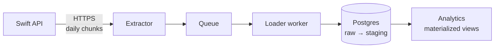

# Case Study Depth — Design Spec

**Date:** 2026-05-20
**Owner:** Jamil Mendez (`Jamil1016` on GitHub)
**Status:** Approved for implementation planning
**Branch context:** Targets `v2-redesign` branch (open PR #1). Lands alongside the v2 visual refresh.

---

## 1. Summary

Sub-project A of the "big project" content expansion. Rewrites the six placeholder MDX case studies into substantive technical writeups with Mermaid architecture diagrams, a skills-tag taxonomy, expanded code samples, real metrics, and a "What I Learned" retrospective per project. Adds tag-filter UI to `/projects`. No new pages; no new projects; no live demos.

**Primary motivation:** the case studies are the highest-leverage hiring artifact — recruiters spend 2 minutes on each. Right now they're 200-word sketches with placeholder.svg diagrams. After this spec ships, they're 800–1200-word sanitized writeups that demonstrate senior-IC-level depth.

---

## 2. Goals & Non-Goals

### Goals
- Replace all six `content/projects/*.mdx` files with deeper, sanitized content (real metrics, real patterns, no employer/customer names)
- Add Mermaid-rendered architecture diagrams (build-time SVG, no client JS) to every case study
- Add a `tags: string[]` field to `ProjectMeta` and assign 5–8 tags per project
- Add a clickable tag-filter UI on `/projects` with URL hash sync (`/projects#tag=python,async`)
- Add a "What I Learned" retrospective section (exactly 3 bullets) to every case study
- Maintain Lighthouse ≥ 95 (no regression — build-time SVG rendering keeps client JS minimal)
- All existing tests continue to pass

### Non-Goals
- Building actual public showcase repos under `Jamil1016` (Sub-project B, separate spec)
- Live runnable demos of DARA / Pipeline Guardian (Sub-project C, separate spec)
- New case studies beyond the existing six
- Multi-language content
- Per-case-study comment sections / engagement features
- Custom rich-text editor for editing case studies in-browser
- Migrating away from MDX

---

## 3. Tag Taxonomy

Twenty-two tags total, organized across four axes. Each project receives 4–8 tags drawn from this list. Tags are lower-kebab-case strings.

### Tech (7)
`python` · `typescript` · `postgresql` · `supabase` · `fastapi` · `nextjs` · `claude-api`

### Patterns (6)
`async` · `etl` · `incremental-sync` · `materialized-views` · `rls` · `dedup`

### AI / agents (6)
`rag` · `nl-sql` · `agent` · `tool-use` · `evals` · `prompt-engineering`

### Domain (3)
`email-parsing` · `data-quality` · `automation`

Tags are flat strings — no parent categories at render time. The grouping above is for human reference when assigning tags; the UI renders all selected tags in a single row with subtle visual weight differentiation (color or shape) optional and deferred.

---

## 4. Per-Project Tag Assignment

| Project slug | Assigned tags |
|---|---|
| `local-pipeline` | `python` · `async` · `etl` · `postgresql` · `materialized-views` · `incremental-sync` · `automation` |
| `pipeline-guardian` | `python` · `claude-api` · `agent` · `tool-use` · `evals` · `automation` · `supabase` |
| `data-analyst-reporting-agent` | `python` · `claude-api` · `nl-sql` · `agent` · `prompt-engineering` · `fastapi` · `nextjs` · `postgresql` |
| `gmail-scraper` | `python` · `email-parsing` · `postgresql` · `automation` · `dedup` |
| `date-validator` | `python` · `data-quality` · `automation` · `postgresql` |
| `report-automation` | `python` · `automation` · `etl` · `postgresql` |

Six projects average 5.8 tags each. No project has fewer than 4 or more than 8 — keeps the visual row balanced.

---

## 5. Case Study Page Structure

Each `.mdx` file produces a page with this fixed structure rendered by `components/case-study/Layout.tsx`:

```
[Hero block — driven by lib/projects.ts entry]
  - Title (project name)
  - Tagline (one-liner)
  - Stack badges (tech logos as text pills)
  - Status pill ("Open-source reference implementation coming <ETA>")

[Tags row — new section, immediately under hero]
  - 5-8 tag pills, neutral color, clickable → /projects#tag=<this-tag>

[MDX body — written content]
  ## The Problem            (1-2 paragraphs)
  ## Architecture           (Mermaid diagram + 1-2 paragraph walkthrough)
  ## Key Decisions          (3-5 bullets, each: "**Decision:** one-line rationale")
  ## Code Samples           (2-3 fenced code blocks, syntax-highlighted, with brief context above each)
  ## Metrics                (3-4 numbers + 1 sentence per number — production-scale, generic)
  ## What I Learned         (exactly 3 bullets: what worked / what I'd change / what I took away)
  ## Links                  (GitHub repo link, demo link if any)
```

Word count target: 800–1200 words per case study. Section ordering is fixed across all six for consistency.

### Why this exact structure

- **The Problem first:** establishes context before architecture (avoids "what is this about?" confusion)
- **Architecture as section 2:** diagram drives understanding before code
- **Key Decisions before Code:** the *why* before the *how*
- **Code Samples in their own section, not inline in earlier sections:** prevents scroll-fatigue from large code blocks mid-prose
- **Metrics after Code:** numbers land harder once the reader has seen what produced them
- **What I Learned at the bottom:** capstone — what makes this a senior writeup
- **Links last:** convert curiosity into action at the moment of peak interest

---

## 6. Mermaid Integration

### Approach

Build-time rendering. MDX files include fenced ` ```mermaid ` blocks; a remark/rehype plugin in the MDX pipeline transforms each to inline SVG at build time. No client-side Mermaid JS shipped to the browser.

### Implementation

Add to `app/projects/[slug]/page.tsx`:

```ts
import { MDXRemote } from "next-mdx-remote/rsc";
import rehypeMermaid from "rehype-mermaid";
import remarkGfm from "remark-gfm";

// in the MDXRemote call:
<MDXRemote
  source={source}
  options={{
    mdxOptions: {
      remarkPlugins: [remarkGfm],
      rehypePlugins: [[rehypeMermaid, { strategy: "inline-svg" }]],
    },
  }}
/>
```

Add `rehype-mermaid`, `remark-gfm`, and `mermaid` as dependencies.

### Fallback

If the Mermaid plugin fails to render a block (syntax error in the diagram), the rehype plugin falls back to rendering the source as a code block — visible but not broken.

### Example diagram

The `local-pipeline` case study includes:



Mermaid syntax used across the six: primarily `graph LR` (left-to-right flow) with subgraph grouping where relevant. No sequence diagrams in v1 of this spec.

---

## 7. Tag Filter UI on `/projects`

### Layout

```
┌─────────────────────────────────────────────────────────┐
│  Projects                                               │
│  Engineering systems that operate themselves.           │
│                                                         │
│  [python] [async] [etl] [agent] [rag] [+ all 17]       │  ← filter pills
│                                                         │
│  Showing: python, async   [clear]                       │  ← active filters bar (only when filters active)
│                                                         │
│  ┌─────────────────────────────────────────────────┐   │
│  │  Project card (matching)                         │   │
│  └─────────────────────────────────────────────────┘   │
│  ┌─────────────────────────────────────────────────┐   │
│  │  Project card (matching)                         │   │
│  └─────────────────────────────────────────────────┘   │
│  ┌─────────────────────────────────────────────────┐   │
│  │  Project card (non-matching — faded 40%)         │   │
│  └─────────────────────────────────────────────────┘   │
└─────────────────────────────────────────────────────────┘
```

### Behavior

- All 17 tags shown by default in a single wrapping row
- Click a tag → adds it to active filters; URL updates to `/projects#tag=<csv>`
- Multi-select = **OR** logic (broader matches — shows projects with ANY selected tag)
- Non-matching projects render at 40% opacity (not removed) — preserves visual rhythm
- "Clear all" link resets filters and URL hash
- URL hash deep-linkable: pasting `/projects#tag=rag,nl-sql` arrives pre-filtered
- Server-rendered initial state (no flash); hydration takes over for interactivity

### Component

New file: `components/projects/TagFilter.tsx`
- Client component (`"use client"`)
- Receives `projects: ProjectMeta[]` and `allTags: string[]` as props
- Manages active-filter state with `useState`
- Syncs to URL hash with `window.location.hash` (no Next.js router refresh — pure client)
- Returns a render-prop or direct grid of cards

---

## 8. Data Model Changes

### `lib/projects.ts`

Extend `ProjectMeta`:

```ts
export type ProjectMeta = {
  slug: string;
  name: string;
  tagline: string;
  stack: string[];
  publicRepoUrl: string;
  publicRepoStatus: "coming" | "live";
  publicEtaWeek?: string;
  privateRepoUrl?: string;
  tags: string[];                // NEW — required, lowercase kebab-case
};
```

All six existing entries gain a `tags` array per Section 4.

### `lib/tags.ts` (new)

```ts
export const ALL_TAGS = [
  // tech
  "python", "typescript", "postgresql", "supabase", "fastapi", "nextjs", "claude-api",
  // patterns
  "async", "etl", "incremental-sync", "materialized-views", "rls", "dedup",
  // ai-agents
  "rag", "nl-sql", "agent", "tool-use", "evals", "prompt-engineering",
  // domain
  "email-parsing", "data-quality", "automation",
] as const;

export type Tag = (typeof ALL_TAGS)[number];

export function isValidTag(s: string): s is Tag {
  return (ALL_TAGS as readonly string[]).includes(s);
}
```

Used by `TagFilter` for the full pill list and by tests to assert each project's tags are valid.

---

## 9. Component Changes

### `components/case-study/Layout.tsx` (modify)

Add a `<TagPills>` row immediately under the header block, before MDX content. Tags link to `/projects#tag=<slug>`. Use the same pill styling as Stack badges but visually distinct (e.g. emerald-tinted border instead of slate).

The "What I Learned" section is rendered from MDX content (not a structural component) — no Layout change needed for that.

### `components/projects/TagFilter.tsx` (new)

Client component described in Section 7.

### `app/projects/page.tsx` (modify)

Wrap the project list in `<TagFilter projects={projects} />`. Pass server-side metadata; the client component handles filter state.

---

## 10. Per-Project Content Brief

For each case study, the rewrite uses these reference points (from MEMORY.md, the v1 spec, and the existing MDX sketches):

### local-pipeline
- Diagram: multi-phase flow — Phase 1 (orgs/projects) → Phase 2 (asset_tasks + user_priorities + forms + timer in parallel) → Post-Phase 2 (backfill → analytics MV refresh)
- Code sample 1: async asyncpg pool on background event-loop thread
- Code sample 2: BaseExtractor inheritance pattern
- Code sample 3: per-day API chunking to bypass the ~1K-row silent truncation
- Metrics: millions of rows / night, 99%+ uptime, sub-15s analytics refresh, 25 tables
- Decisions: ThreadPool + Queue + loader worker; raw → staging → analytics split; write-once asset_did
- Learned: per-day chunking caught a silent API bug invisible from larger ranges; the asyncpg-on-background-thread pattern beats sync-async bridging for sync callers
- Tags: python · async · etl · postgresql · materialized-views · incremental-sync · automation

### pipeline-guardian
- Diagram: LLM-in-the-loop with deterministic safety gates around tool calls
- Code sample 1: structured tool schema for "remediate this failure type"
- Code sample 2: deterministic safety gate around destructive ops (re-check before apply)
- Code sample 3: eval harness with golden set of past failures
- Metrics: most recurring failure classes auto-remediated within 5 min, MTTR cut by ~10× on targeted incident type
- Decisions: never let the LLM see live destructive paths without a deterministic guard; golden set evals before every prompt change; dry-run vs apply modes
- Learned: structured tool calls beat free-form for safety-critical agents; eval-first prompt engineering catches regressions
- Tags: python · claude-api · agent · tool-use · evals · automation · supabase

### data-analyst-reporting-agent
- Diagram: NL question → schema-aware prompt builder → Claude plan → SQLGuard validator → Postgres → CSV + chart
- Code sample 1: schema-aware prompt construction from information_schema
- Code sample 2: SQLGuard whitelist enforcing read-only + allowed tables
- Code sample 3: planner/executor two-step pattern
- Metrics: typical query latency sub-3s, hundreds of saved analyst hours/quarter
- Decisions: schema-only prompts (never send live data); DB-role-level read-only; planner/executor split
- Learned: most NL→SQL fails happen at schema disambiguation, not SQL generation; safety rails matter more than model choice
- Tags: python · claude-api · nl-sql · agent · prompt-engineering · fastapi · nextjs · postgresql

### gmail-scraper
- Diagram: Gmail API → message fetch → BeautifulSoup parse → header pattern match → JSONB upsert
- Code sample 1: ordered header pattern list (LANDLORD CLOSE OUT before CLOSE OUT, etc.)
- Code sample 2: hidden-span removal + label rejoin
- Code sample 3: ON CONFLICT DO NOTHING upsert
- Metrics: thousands of emails/day, <5 min lag, schema drift handled without code changes
- Decisions: dynamic JSONB schema over fixed; ordered pattern list for prefix disambiguation; idempotent upserts
- Learned: HTML email parsers fail in the small (hidden spans break words); dynamic schemas absorb format drift
- Tags: python · email-parsing · postgresql · automation · dedup

### date-validator
- Diagram: source A (task dates) + source B (email dates) → natural-key join → daily diff → Excel + Sheets
- Code sample 1: natural-key normalization (handle whitespace, two-digit years, placeholders)
- Code sample 2: daily diff routine with deterministic ordering
- Code sample 3: Sheets upload pattern (idempotent rewrite)
- Metrics: dozens of mismatches surfaced/week, near-zero false positives after key normalization
- Decisions: natural keys over surrogates (surrogates drifted); daily cadence over real-time (less noise)
- Learned: data quality bugs hide in the join key; normalization is a feature not infrastructure
- Tags: python · data-quality · automation · postgresql

### report-automation
- Diagram: Apps Script weekday trigger → repository_dispatch → GHA workflow → Python generator → SMTP email
- Code sample 1: is_weekend() gate at all trigger sources
- Code sample 2: idempotent report generator (running twice = same output)
- Code sample 3: Chart.js + matplotlib hybrid for inline visual
- Metrics: daily delivery <90s end-to-end, multi-month uninterrupted run streak
- Decisions: Apps Script triggers over GHA cron (reliability); idempotent generator (replay-safe); weekend gating at the source
- Learned: GHA cron drifts; Apps Script triggers don't; idempotency lets you re-run without thinking
- Tags: python · automation · etl · postgresql

---

## 11. Files to Create / Modify

### Create
- `lib/tags.ts` — tag constants + validation
- `components/projects/TagFilter.tsx` — client-side tag filter

### Modify
- `lib/projects.ts` — add `tags` field to type + each project
- `components/case-study/Layout.tsx` — add `<TagPills>` row under header
- `app/projects/page.tsx` — wrap in `<TagFilter>`
- `app/projects/[slug]/page.tsx` — add `rehype-mermaid` to MDX options
- `content/projects/local-pipeline.mdx` — full rewrite per Section 10
- `content/projects/pipeline-guardian.mdx` — full rewrite per Section 10
- `content/projects/data-analyst-reporting-agent.mdx` — full rewrite per Section 10
- `content/projects/gmail-scraper.mdx` — full rewrite per Section 10
- `content/projects/date-validator.mdx` — full rewrite per Section 10
- `content/projects/report-automation.mdx` — full rewrite per Section 10
- `package.json` — add `rehype-mermaid`, `mermaid`, `remark-gfm`
- `tests/lib/projects.test.ts` — extend to assert every project has 4+ valid tags

### Delete
- `public/diagrams/placeholder.svg` — no longer referenced after MDX rewrites (verify nothing else uses it)

---

## 12. Testing

### Unit tests
- `tests/lib/projects.test.ts` — extend existing tests:
  - Every project has `tags` field with length 4–8 (inclusive)
  - Every tag string is in `ALL_TAGS`
  - No duplicate tags within a project
- `tests/lib/tags.test.ts` (new) — `isValidTag` accepts known tags, rejects unknown

### Integration
- `npm run build` succeeds with rehype-mermaid in the pipeline
- All six `/projects/<slug>` routes render
- No client-side Mermaid JS bundle (verify with bundle analyzer or grep)

### Manual / visual (not automated)
- Tag filter on `/projects` filters correctly
- URL hash sync works (paste `/projects#tag=python,async` → arrives filtered)
- Mermaid diagrams render as SVG (not raw text) on every case study
- Mobile responsive at 375px

---

## 13. Success Criteria

1. All 6 case studies have real Mermaid architecture diagrams (no `placeholder.svg`)
2. Each case study has 4–8 tags rendered as pills
3. Each case study has a "What I Learned" section with exactly 3 bullets
4. Each case study is 800–1200 words
5. `/projects` index has clickable tag filter with URL hash sync
6. Lighthouse Performance ≥ 95 on `/projects/local-pipeline` (most diagram-heavy)
7. No client-side Mermaid JS in the production bundle
8. All existing tests pass + new tag-validation tests pass
9. No mention of employer name, customer names, or specific carrier names in any case study

---

## 14. Open Questions (for user review)

- **Tag visual treatment:** all tags same color, or color-by-axis (tech blue / patterns gray / ai-agents emerald / domain warm)? Default: all same neutral for now, add color later if needed.
- **Project sort order on `/projects` index when filtered:** keep original order (flagship first) or re-sort by relevance / tag-match-count? Default: keep original.
- **"Clear all" placement:** inline with active-filters bar, or its own button? Default: inline.

These are all small tweaks doable during implementation.

---

## 15. Out of Scope (Future Work)

- **Sub-project B — Public Showcase Repos:** building the clean-room implementations under `Jamil1016`. Separate spec.
- **Sub-project C — Live Demos:** DARA + Pipeline Guardian on synthetic data with embedded UI. Separate spec.
- **Tag analytics:** "people who clicked this tag also looked at…" — defer until traffic justifies.
- **Per-tag landing pages:** `/tags/rag` showing all RAG-tagged content. Defer until blog system exists.
- **OG image variants per case study:** dynamic OG generation. Defer.
